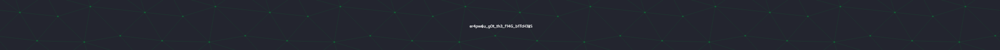

<h2> Hi, I'm Mark Rhogie! aka <a href="https://www.buymeacoffee.com/jihyoppa">er4pwn   </a> </h2>


 <p><em>Currently studying Information Technology at<a href="https://msugensan.edu.ph/"> Mindanao State University</a></br>
</em></p>


[](https://facebook.com/jihyoppa)


#### 📫 How to reach me:  

[](https://www.facebook.com/jihyoppa/)  &nbsp; []()  &nbsp; []()  &nbsp; [](https://www.linkedin.com/in/mark-rhogie-purok-5630b619b/)  &nbsp; [](https://steamcommunity.com/profiles/76561199415906190/)  &nbsp; []()  &nbsp; <a href="mailto:wenard.grometes54@gmail.com"> 

### Languages and Tools:


<br>
<br>

```javascript
┌──(root㉿er4pwn)-[~]
└─$ ./whoami.ko

const er4pwn = {
  pronouns: "he" | "him",
  description: "Hi, My name is Mark Rhogie Purok aka jihyoppa. I'm a 20 years old Penetration Tester in the Philippines.
                I'm fascinated by Web Security, Network Security and Bug Bounty Hunting. Besides hacking, I love sports,
                video games, instruments and listening to all genres music"
  code: [Python, Bootstrap, Html, Css, Php, Django, Go],
  tools for recon: [Burpsuite, Sublist3r, Nikto, Nmap, SqlMap, WpScan, Shodan],
  musicRecommend: {
                        BoyWithUke: "Long Drives",
                        One OK Rock: "Re:make",
                        R, Kelly: "Ignition"
                      },
 motto: "If you're good on something do not do it for free"
}
```

------------------------------------------------------------------------------------------------------------------------------------------------------------------------------


---
